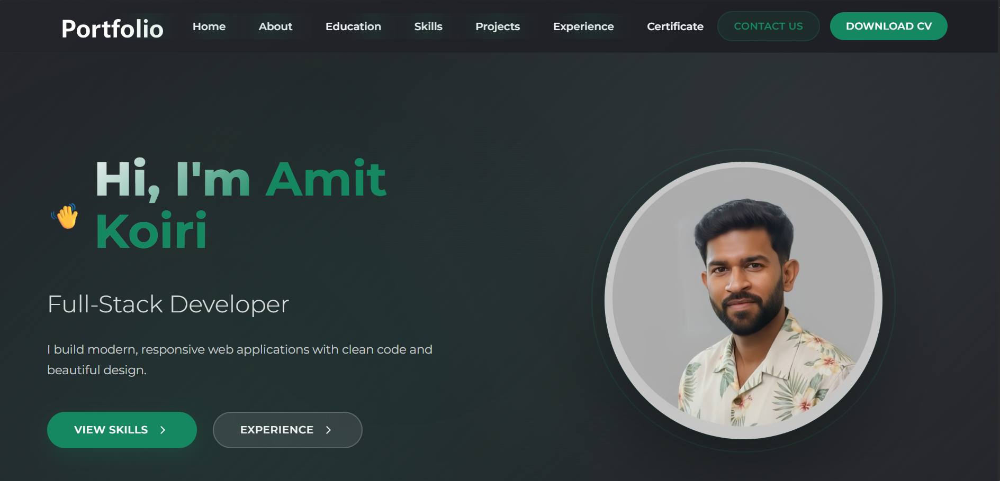

# Amit Koiri - Portfolio Website

A modern, responsive portfolio website showcasing my skills, projects, and experience as a Full-Stack Developer.



## 🌐 Live Demo

[Add your live portfolio link here]

## 📋 Table of Contents

- [About](#about)
- [Features](#features)
- [Technologies Used](#technologies-used)
- [Projects](#projects)
- [Installation](#installation)
- [Usage](#usage)
- [Customization](#customization)
- [Contact](#contact)
- [License](#license)

## 📖 About

This is my personal portfolio website designed to showcase my skills, projects, and professional journey as a Full-Stack Developer. The website features a modern, responsive design with smooth animations and an intuitive user interface.

Key sections include:
- **Home**: Introduction and quick access to skills/experience
- **About**: Personal background and professional summary
- **Education**: Academic journey with timeline visualization
- **Skills**: Technical competencies with visual icons
- **Projects**: Featured projects with descriptions and tech stacks
- **Experience**: Professional work experience
- **Contact**: Interactive contact form

## ✨ Features

- **Responsive Design**: Optimized for all devices (desktop, tablet, mobile)
- **Modern UI/UX**: Clean, professional design with smooth animations
- **Interactive Elements**: 
  - Contact form with Formspree integration
  - Smooth scrolling navigation
  - Hover effects and transitions
- **Performance Optimized**: Fast loading times and efficient code structure
- **Accessibility**: Semantic HTML and keyboard navigation support

## 🛠 Technologies Used

### Frontend
- **HTML5**: Semantic markup and structure
- **CSS3**: Custom styling with Flexbox and animations
- **JavaScript**: Interactive functionality and form handling
- **Google Fonts**: Montserrat font family

### Backend & Integration
- **Formspree**: Contact form submission handling
- **Git**: Version control

### Design & Icons
- **Custom CSS**: No external CSS frameworks used
- **SVG Icons**: Bootstrap Icons for social media and UI elements

## 🚀 Projects

### Portfolio Website
- **Description**: Personal portfolio website to showcase skills and projects
- **Technologies**: HTML, CSS, JavaScript
- **Features**: Responsive design, contact form, project showcase

### Airport Management System
- **Description**: System for managing airport operations and workflows
- **Technologies**: HTML, CSS, JavaScript
- **Features**: Database management, real-time operations handling

## 📦 Installation

To run this portfolio locally:

1. **Clone the repository**
   ```bash
   git clone https://github.com/koiri16/portfolio-website.git
